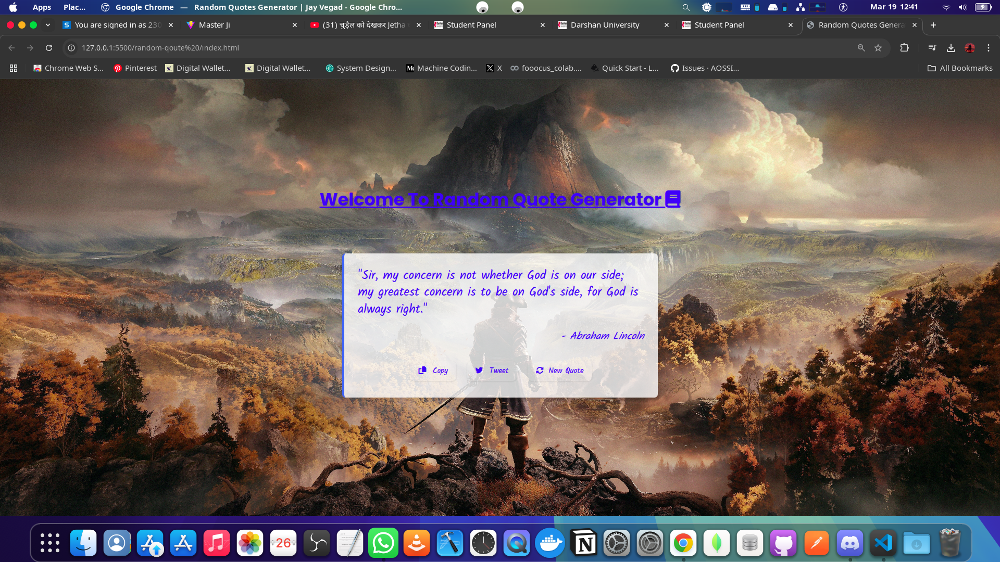
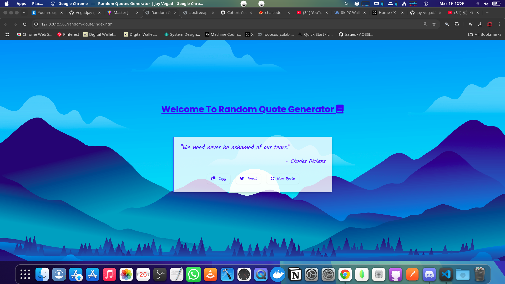

# Random Quote Generator (Challange - 1)

A beautiful, responsive web application that displays random inspirational quotes on dynamic backgrounds. Users can generate new quotes, copy them to clipboard, or share them on Twitter.

*Screenshot 1: Quote Generator with a light background*

*Screenshot 2: Quote Generator with a dark background*

*Screenshot 3: Mobile view of the Quote Generator*

## Features

- **Random Quote Generation**: Fetches quotes from an external API
- **Dynamic Backgrounds**: Changes background image with each new quote
- **Copy to Clipboard**: Easy sharing of quotes with one click
- **Twitter Integration**: Directly tweet quotes with attribution
- **Responsive Design**: Works on desktop and mobile devices

## Technologies Used

- HTML5
- CSS3 with Tailwind CSS
- JavaScript (ES6+)
- Font Awesome icons
- External API (freeapi.app)

## How It Works

1. When the page loads, a random quote is fetched from the API
2. The quote and author are displayed with a random background image
3. Users can:
   - Generate a new quote by clicking the "New Quote" button
   - Copy the quote to clipboard using the "Copy" button
   - Share the quote on Twitter via the "Tweet" button

## JavaScript Functionality

- **Event Listeners**: Set up for DOM content loaded and button clicks
- **API Integration**: Fetches random quotes from freeapi.app
- **Background Management**: Rotates through a collection of background images
- **Copy Functionality**: Uses the Clipboard API to copy quotes
- **Twitter Integration**: Opens a pre-populated tweet in a new window

## CSS Styling

The project uses Tailwind CSS for responsive design and layout, with custom CSS classes for:
- Quote box styling and transitions
- Button styling and hover effects
- Font customization
- Background image transitions

## Installation and Usage

1. Clone this repository or download the files
2. Open `index.html` in your web browser
3. No build process or dependencies required

## Future Enhancements

- Add more background images
- Implement quote categories
- Add dark/light mode toggle
- Create local storage for favorite quotes
- Add more social sharing options
